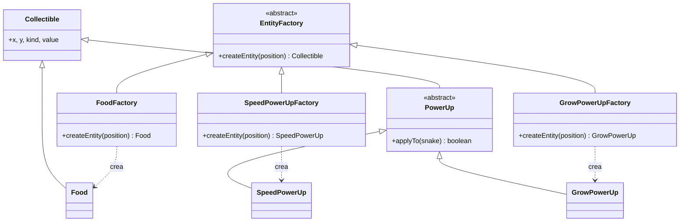

# Factory Method — `EntityFactory` / `FoodFactory` / `SpeedPowerUpFactory` / `GrowPowerUpFactory`

## Problema que resuelve

En `snake-antes/server.js`, la comida y los power-ups se crean como objetos literales repetidos e inconsistentes: `{ x: fx, y: fy }` para la comida (líneas 236-244) y `{ x: px, y: py, kind: ... }` para el power-up (líneas 263-271), cada uno con su propio bucle de "buscar posición libre". Si mañana se agrega un tercer tipo de power-up, hay que volver a copiar ese mismo patrón y además tocar el `if/else` que decide qué efecto aplicar (`server.js:245-254`).

## Estructura aplicada

`EntityFactory` es el *Creator* abstracto (`createEntity(position)`); cada factory concreta decide qué *Product* concreto instanciar. `GameRoom` (`src/core/GameRoom.js`) nunca pregunta "¿qué tipo de power-up es este?" con un `if/else`: cada `PowerUp` implementa su propio `applyTo(snake)`, así que aplicar el efecto es simplemente `this.powerUp.applyTo(player.snake)`.

## Por qué Factory Method y no otra alternativa

- **Alternativa descartada — una función `createEntity(kind, position)` con un `switch` interno:** es justo lo que penaliza la rúbrica ("un Factory Method que sigue usando `if/elif` internamente"); mover el `switch` a una función no elimina el problema de fondo, solo lo reubica.
- **Alternativa descartada — Abstract Factory:** tendría sentido si existieran *familias* de entidades relacionadas (p. ej. un modo de juego "clásico" vs. uno "caótico" con familias completas de power-ups distintos). Aquí solo hay productos individuales sin familias, así que Abstract Factory sería una capa de más sin beneficio.
- **Por qué Factory Method:** el problema real es "crear el producto correcto sin que el llamador conozca la clase concreta ni el efecto que produce", que es exactamente lo que resuelve delegar la creación a subclases (`FoodFactory`, `SpeedPowerUpFactory`, `GrowPowerUpFactory`) y el comportamiento a los propios productos (`applyTo`). Agregar un power-up nuevo es agregar una clase y una factory, sin tocar `GameRoom`.
