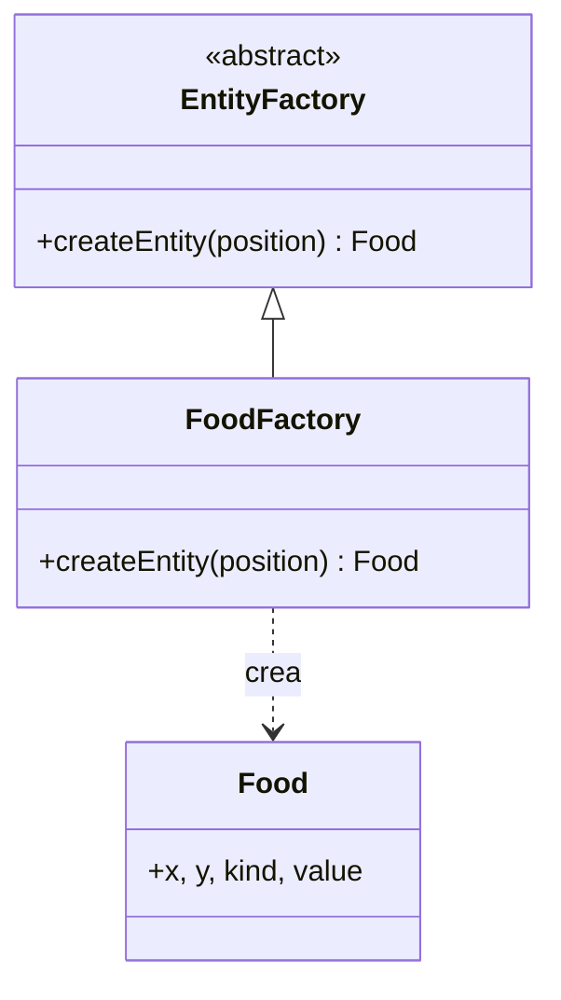

# Factory Method — `EntityFactory` / `FoodFactory`

## Problema que resuelve

En `snake-antes/server.js`, la comida se crea como un objeto literal repetido e inconsistente: `{ x: fx, y: fy }` (líneas 242-253), con su propio bucle de "buscar posición libre" escrito en línea dentro del game loop. Si se quisiera agregar un nuevo tipo de entidad coleccionable, la única forma de hacerlo sería copiar ese mismo bucle otra vez con otro nombre de variable.

En `snake-despues`, en cambio, crear la comida es: `this.foodFactory.createEntity(this.randomFreePosition())` — la búsqueda de posición libre vive en un solo lugar (`GameRoom.randomFreePosition`) y la construcción del objeto vive en `FoodFactory`.

## Estructura aplicada

`EntityFactory` es el *Creator* abstracto (`createEntity(position)`); `FoodFactory` es el *Creator* concreto que decide qué *Product* concreto instanciar (`Food`). `GameRoom` (`src/core/GameRoom.js`) nunca construye el objeto `Food` a mano ni conoce sus campos internos: solo le pide a la factory que cree la entidad en una posición dada.

## Por qué Factory Method y no otra alternativa

- **Alternativa descartada — construir `{ x, y, kind: 'food', value: 10 }` directamente en `GameRoom`:** es justo lo que hacía el "antes"; funciona mientras exista un solo tipo de entidad, pero acopla `GameRoom` a la forma exacta del objeto y obliga a tocar `GameRoom` cada vez que la entidad cambie o se agregue una nueva.
- **Alternativa descartada — Abstract Factory:** tendría sentido si existieran *familias* de entidades relacionadas (por ejemplo, un modo de juego "clásico" vs. uno con un catálogo completo de entidades distintas). Aquí solo hay un producto individual, así que Abstract Factory sería una capa de más sin beneficio.
- **Por qué Factory Method:** el problema real es "crear el producto correcto sin que el llamador construya el objeto a mano ni conozca sus detalles internos", que es exactamente lo que resuelve delegar la creación a una subclase de `EntityFactory`. Si mañana se agrega un segundo tipo de entidad, la extensión es una clase de producto y una factory nuevas — `GameRoom` solo cambia en el punto donde invoca `createEntity`, tal como ya lo demuestra el `EntityFactory` abstracto reutilizable para cualquier entidad futura.
