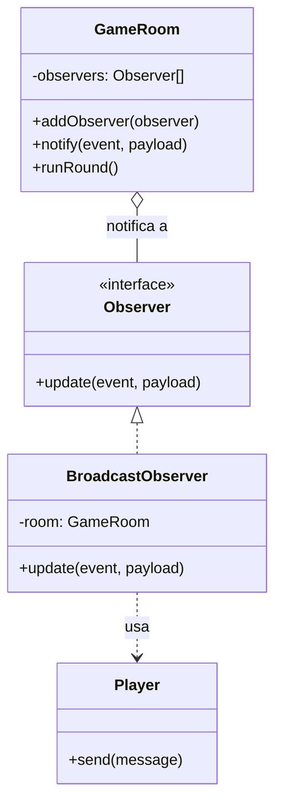

# Observer — `GameRoom` (subject) / `BroadcastObserver` (observer)

## Problema que resuelve

En `snake-antes/server.js:177-298`, el game loop entero (mover serpientes, calcular las tres colisiones, generar comida y power-ups, decidir el fin de partida) termina con un `for` que llama `room.players[i].ws.send(...)` directamente (línea 296). La lógica del juego y el transporte por WebSocket están en la misma función: es imposible probar las reglas del juego sin un socket real, y es imposible cambiar cómo se notifica el estado (por ejemplo, para loggear cada tick) sin tocar el game loop.

## Estructura aplicada

`GameRoom` (el *subject*) solo conoce la interfaz `update(event, payload)`; nunca importa `ws` ni sabe que existe un WebSocket. Al terminar cada ronda llama `this.notify('state', this.getSnapshot())`, y `CountdownState` llama `this.room.notify('countdown', { value })`. `BroadcastObserver` (el *observer concreto*, en `src/observers/BroadcastObserver.js`) es quien traduce esos eventos a mensajes JSON y los envía a cada `Player` de la sala.

## Por qué Observer y no otra alternativa

- **Alternativa descartada — seguir llamando `ws.send` directamente desde `GameRoom` (lo que ya hacía el "antes"):** acopla la lógica del juego al transporte; no se puede probar `runRound()` sin instanciar sockets reales, y no se puede añadir un segundo consumidor del evento (por ejemplo, un logger de partidas) sin volver a tocar el game loop.
- **Alternativa descartada — que `GameRoom` reciba una función `broadcast(payload)` por parámetro:** resuelve el desacople para un solo consumidor, pero no escala a varios observadores (loggear y difundir a la vez) sin convertirse, de hecho, en una lista de callbacks — que es justamente lo que ya hace Observer con nombre y contrato explícitos (`update`).
- **Por qué Observer:** el juego genuinamente tiene un *sujeto* (el estado de la sala cambia en cada tick) y potencialmente varios *interesados* en enterarse (hoy solo la difusión WebSocket, pero el mismo mecanismo permitiría añadir métricas o logging sin modificar `GameRoom`). Los tests de `tests/patterns.test.js` verifican `BroadcastObserver` con una sala falsa, sin abrir un socket real, precisamente gracias a este desacople.
