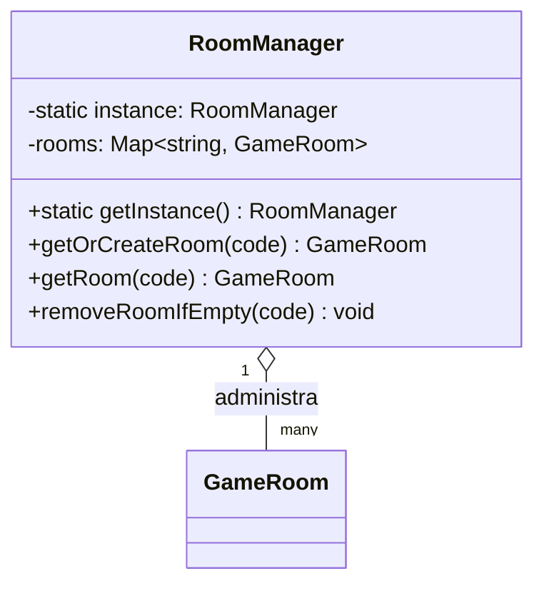

# Singleton — `RoomManager`

## Problema que resuelve

En `snake-antes/server.js:8-9`, el registro de salas es una variable global (`let rooms = {}`) que cualquier parte del archivo lee y muta directamente. No hay garantía de que exista un único registro consistente, y probar esa lógica de forma aislada es difícil porque el estado vive fuera de cualquier clase.

## Estructura aplicada

`RoomManager` (`src/core/RoomManager.js`) guarda la instancia en una variable de módulo (`let instance`); su constructor devuelve esa instancia si ya existe, y `getInstance()` es el punto de acceso público. `connectionHandler.js` nunca hace `new RoomManager()` directamente para trabajar con salas: siempre pasa por `RoomManager.getInstance()`.

## Por qué Singleton y no otra alternativa

- **Alternativa descartada — variable global (lo que ya hacía el "antes"):** funciona, pero expone el estado sin control de acceso, no se puede inyectar un mock alternativo en pruebas, y no comunica intención (cualquiera puede reasignar `rooms = {}` por error).
- **Alternativa descartada — pasar el registro de salas como parámetro a cada handler:** más "puro" en términos de inyección de dependencias, pero para un servidor de un solo proceso agrega una capa de parámetros repetitivos sin beneficio real, ya que solo existe un registro de salas por proceso Node.
- **Por qué Singleton:** el dominio realmente necesita **un único** registro de salas por proceso (no tiene sentido tener dos), y `getInstance()` deja explícito en el código que se trata de un recurso compartido único, además de facilitar sustituirlo por un doble de prueba reasignando `instance` en tests si hiciera falta.
