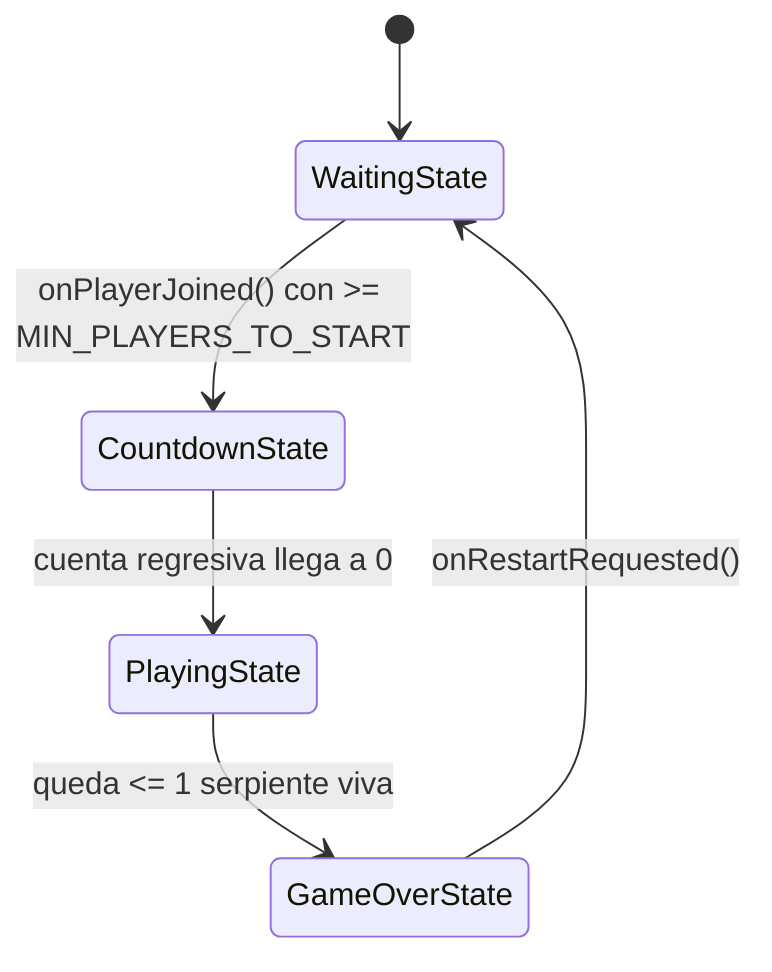
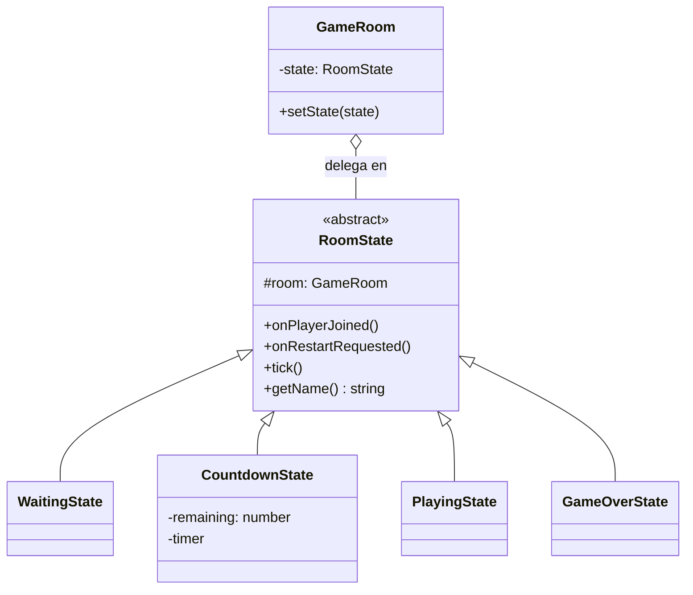

# State — `RoomState` (Waiting / Countdown / Playing / GameOver)

## Problema que resuelve

En `snake-antes/server.js`, la fase de la partida se controla con un campo de texto (`room.state = 'waiting' | 'countdown' | 'playing' | 'gameover'`) revisado con comparaciones sueltas, y la transición de una fase a otra está **duplicada literalmente** entre `join` (líneas 86-99) y `restart` (líneas 141-154): el mismo bloque de cuenta regresiva copiado y pegado. Nada impide, por ejemplo, llamar `startGameLoop` dos veces sobre la misma sala si dos eventos coinciden.

## Estructura aplicada

`GameRoom` (el *contexto*) nunca pregunta "¿en qué fase estoy?" con un `if`: delega `onPlayerJoined()`, `onRestartRequested()` y `tick()` al objeto `state` actual, y cada estado concreto decide a qué otro estado transicionar llamando `room.setState(new SiguienteState(room))`.

## Por qué State y no otra alternativa

- **Alternativa descartada — mantener el campo `state: string` con un `switch` en cada método (lo que ya hacía el "antes"):** cada nuevo comportamiento por fase agrega una rama más al mismo `switch`, y la duplicación de la cuenta regresiva entre `join` y `restart` es evidencia directa de que la lógica no está en un solo lugar.
- **Alternativa descartada — usar solo banderas booleanas (`isWaiting`, `isPlaying`, `isCountingDown`):** con 4 fases mutuamente excluyentes, las combinaciones inválidas de banderas (`isWaiting && isPlaying`) se vuelven posibles por error; un `string`/`enum` ya es mejor, pero sigue centralizando el comportamiento fuera de la fase misma.
- **Por qué State:** el comportamiento de `addPlayer`, `restart` y `tick` cambia genuinamente según la fase de la sala, y cada fase tiene su propia lógica de transición (la cuenta regresiva solo existe dentro de `CountdownState`). Modelar cada fase como una clase elimina la duplicación entre `join`/`restart` y hace imposible, por construcción, ejecutar `tick()` de forma significativa fuera de `PlayingState`.
