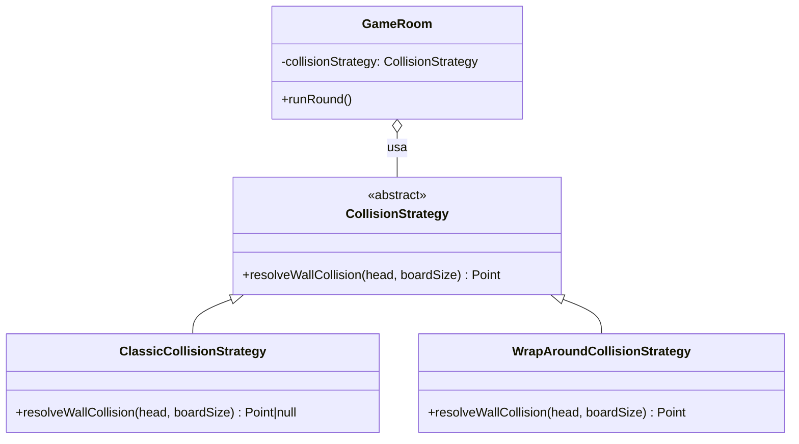

# Strategy — `CollisionStrategy`

## Problema que resuelve

En `snake-antes/server.js:207`, la regla de "qué pasa al tocar el borde del tablero" está escrita en línea, mezclada con el resto del game loop:
```js
if (newHead.x < 0 || newHead.x >= 30 || newHead.y < 0 || newHead.y >= 30) {
  p.alive = false;
  continue;
}
```
Si se quisiera ofrecer un modo de juego alternativo (por ejemplo, que la serpiente reaparezca del otro lado en vez de morir), habría que editar el game loop y arriesgar romper el resto de su lógica — viola el Principio Abierto/Cerrado.

## Estructura aplicada



`GameRoom` recibe la estrategia por constructor (`new GameRoom(code, collisionStrategy)`) y la usa en `runRound()` sin saber cuál es: `ClassicCollisionStrategy.resolveWallCollision` devuelve `null` para matar a la serpiente, mientras que `WrapAroundCollisionStrategy` calcula la posición al otro lado del tablero con módulo (`(head.x + boardSize) % boardSize`).

## Por qué Strategy y no otra alternativa

- **Alternativa descartada — un flag `wrapMode: boolean` con un `if` en el game loop:** funciona para dos modos, pero cada modo nuevo obliga a agregar otra rama al mismo `if`, exactamente el problema que ya existía en el "antes".
- **Alternativa descartada — subclasificar `GameRoom` (`ClassicGameRoom`, `WrapAroundGameRoom`):** duplicaría toda la lógica de `runRound` (spawn de comida, colisión con otras serpientes, notificación) solo para variar una regla puntual — viola el principio de composición sobre herencia.
- **Por qué Strategy:** la única parte que varía entre modos de juego es la regla de colisión con el borde; encapsularla en una interfaz intercambiable permite agregar un tercer modo (por ejemplo, "paredes con trampas") como una clase nueva, sin tocar `GameRoom` ni arriesgar el resto del bucle de juego.
